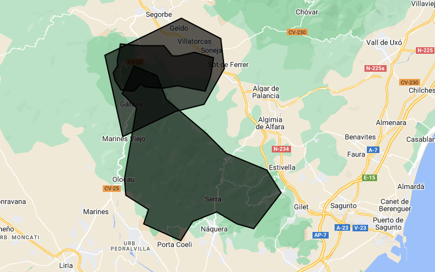
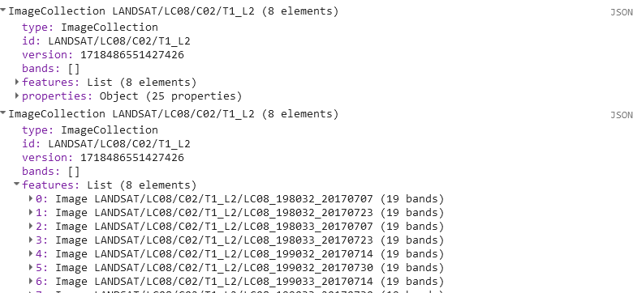
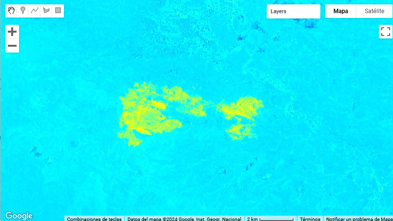
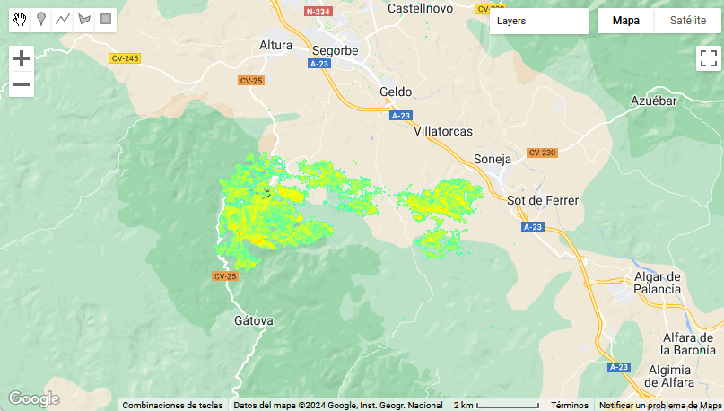
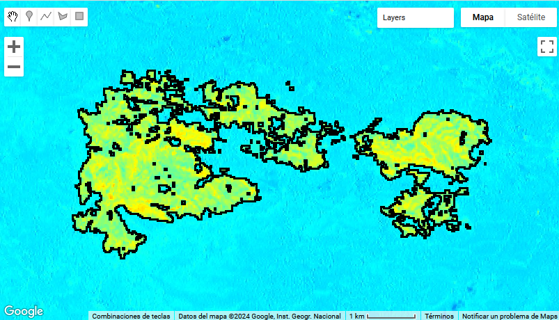

# Capítulo 6: Google Earth Engine en Ciencias Forestales

## 1. Temario introductorio a Google Earth Engine (GEE)

### Introducción

Google Earth Engine (GEE) es una plataforma basada en la nube para el análisis geoespacial a escala planetaria que incorpora las capacidades computacionales masivas de Google para abordar una variedad de trabajos ambientales. Permitiendo realizar procesos de teledetección con grandes cantidades de datos sin la necesidad de almacenarla en tu disco local para poder extraerle la información de interés.

Pese a ser una plataforma de supercomputación, GEE está diseñado para ayudar a los investigadores o usuarios a difundir fácilmente sus trabajos. Permitiéndoles producir resultados de forma sistemática una vez que han desarrollado sus algoritmos, incluso pueden crear y compartir aplicaciones iterativas sin ser un programador experto. Esto, ha hecho que la teledetección cambie su método de procesado clásico, que era mucho más tedioso y que requería mayor tiempo de trabajo para obtener resultados.

A través de la interfaz de programación de aplicaciones (API), que es en lenguaje de programación JavaScript o sincronizándola con Python, se accede al catálogo de datos públicos de varios petabytes, que se ubica en un servicio de computación paralelo de alto rendimiento. Estos datos incluyen una gran variedad de información espacio-temporal, imágenes aéreas y satelitales, en longitudes de onda ópticas y no ópticas, variables ambientales, pronósticos y retrovisores meteorológicos y climáticos, cobertura terrestre, topográficos y sociodemográficos, incluso datos económicos. Además, se puede disponer de otros datos de carácter privado, que el usuario proporcione a la plataforma.

Otro aspecto importante de esta plataforma es la gran cantidad de procesos que se pueden realizar con los datos disponible. Desde crear bases de datos propias con procesos de selección personalizados, hasta realizar con imágenes diferentes tipos de clasificaciones. Esto puede realizarse, gracias a innumerables algoritmos implementados en la plataforma listos para facilitarles los pasos más comunes a los usuarios. Además, gracias la replicabilidad de los códigos, se pueden utilizar muchos pasos de los ejemplos que la propia plataforma proporciona o de procesos de otros trabajos.

Por todo esto, el objetivo principal que se quiere remarcar en este capítulo es la polivalencia que esta plataforma proporciona a los usuarios que trabajan en teledetección. Permitiéndoles disponer de una herramienta de alta potencialidad para la extracción y procesado de múltiples tipos de información espacio-temporales.

### Superficie incendiada

En este ejercicio se va a determinar la superficie incendiada ocurrido en las inmendiaciones de Sot de Ferrer en el año 2017.

Se crea un nuevo script en el panel de entorno de trabajo y se introducen las coordenadas de referencia en el editor de código del panel de programación, para seguidamente guardar en *Save* y ejecutar en *Run*.

```js
var sch = 
    /* color: #98ff00 */
    /* shown: false */
    ee.Geometry({
      "type": "GeometryCollection",
      "geometries": [
        {
          "type": "Polygon",
          "coordinates": [
            [
              [-0.48137772310656146, 39.77378318679593],
              [-0.49236405123156146, 39.794889529299425],
              [-0.5184565805284365, 39.8033302534149],
              [-0.5321894906846865, 39.779060379383324],
              [-0.5157099984971865, 39.766394437418214],
              [-0.5294429086534365, 39.70408632909143],
              [-0.5280696176378115, 39.68929308672391],
              [-0.5019770883409365, 39.67661064125064],
              [-0.5074702524034365, 39.66392586664878],
              [-0.46489823091906146, 39.64912401944591],
              [-0.45116532076281146, 39.66604015748592],
              [-0.42369950045031146, 39.67449667389014],
              [-0.40035355318468646, 39.66392586664878],
              [-0.38112747896593646, 39.65969709089758],
              [-0.34954178560656146, 39.69140660117948],
              [-0.36602127779406146, 39.71148176125452],
              [-0.41271317232531146, 39.72627024734803],
              [-0.43605911959093646, 39.74422343135387]
            ]
          ],
          "evenOdd": true
        },
        {
          "type": "Polygon",
          "coordinates": [
            [
              [-0.5315885585207525, 39.741269975078524],
              [-0.4711637538332525, 39.763441931646874],
              [-0.4382047694582525, 39.76977546555002],
              [-0.4148588221926275, 39.801434395065336],
              [-0.4189786952395025, 39.82780570748005],
              [-0.4642972987551275, 39.8457324200794],
              [-0.5521879237551275, 39.81303901907389]
            ]
          ],
          "geodesic": true,
          "evenOdd": true
        }
      ],
      "coordinates": []
    }),
    sch2 = 
    /* color: #ffc82d */
    /* shown: false */
    ee.Geometry.Polygon(
        [[[-0.5358624356072141, 39.81631908863327],
          [-0.5379223721306516, 39.80919864133964],
          [-0.5379223721306516, 39.8033962500483],
          [-0.5430722134392454, 39.79785714701586],
          [-0.5410122769158079, 39.79073478753645],
          [-0.5341458218376829, 39.78255635421349],
          [-0.5197262661736204, 39.781237161019064],
          [-0.5162930386345579, 39.7836116905602],
          [-0.5118298428337766, 39.78783287408843],
          [-0.5056500332634641, 39.784930838232356],
          [-0.4860806362908079, 39.78413935266389],
          [-0.4689144985954954, 39.78598613816098],
          [-0.4373288052361204, 39.781237161019064],
          [-0.43080567291190164, 39.79469174496506],
          [-0.4277157681267454, 39.811044754056205],
          [-0.44934510162283914, 39.81579167338815],
          [-0.46719788482596414, 39.812363375643045],
          [-0.4750943081658079, 39.812363375643045],
          [-0.4847073452751829, 39.82159301848185],
          [-0.5008435147087766, 39.82132933160194],
          [-0.5125164883415891, 39.82132933160194],
          [-0.5348324673454954, 39.82291143770356]]]);
```

Cuando se imprimen las variables generadas *sch* y *sch2*, en la pestaña de consola del panel de información nos indica que se trata de geometrías poligonales:

```js
print(sch,sch2)
```


Y se pueden visualizar en la ventana de mapa. Se trata de aproximaciones al lugar donde ocurrió el incendio.

```js
Map.addLayer(sch);
Map.addLayer(sch2);
```



A continuación se busca la colección de imágenes Landsat 8 de la zona para junio de 2017, previa al incendio, y julio del mismo año, posterior al incendio.

```js
//Landsat8 colection
var col1 = ee.ImageCollection('LANDSAT/LC08/C02/T1_L2').filterBounds(sch)
.filterDate('2017-06-01','2017-06-30');
var col2 = ee.ImageCollection('LANDSAT/LC08/C02/T1_L2').filterBounds(sch)
.filterDate('2017-07-01','2017-07-31');
print(col1,col2);
```

Existen 8 imágenes para cada uno de los meses, debido a que en la zona se situa el límite en la trayectoria de toma de datos satelitales. Esto puede observarse en el código con el que se nombran las imágenes. Después de *LC08_* le sigue un código de 6 cifras donde las 3 primeras se refieren al *path* de la imagen y las 3 siguientes al *row*. Los últimos 8 números del identificador de la imagen corresponden a la fecha en la que fue tomada en año-mes-día *yyyymmdd*.



A continuación se mosaican las imágenes resultantes de las colecciones en cada mes para conseguir una única imagen del mes de junio y otra del mes de julio.

```js
//Month
var juny = col1.mosaic()
var july = col2.mosaic()
print(juny,july)
```

Ahora ya se puede calcular el índice NBR para cada mes, tomando como referencia las bandas 5 y 7 para realizar la diferencia normalizada entre ambas y, posteriormente, se calcula la diferencia entre los meses.

```js
//NBR
var nbr1 = juny.normalizedDifference(['SR_B5','SR_B7']).rename('NBR');
var nbr2 = july.normalizedDifference(['SR_B5','SR_B7']).rename('NBR');
print(nbr1,nbr2);

//diference
var dnbr = nbr1.subtract(nbr2)
var color = {min: -0.3, max: 1.0, palette:['0000ff', '00ffff', 'ffff00', 'ff0000', 'ffffff'],};

//Mapa
Map.addLayer(dnbr, color, 'NBR');
```



A continuación se crea una máscara en la que se seleccionan los valores de la diferencia de entre los índices NBR que son superiores a 0.1, que será donde se localice el incendio.

```js
//mascara
var mask = dnbr.updateMask(dnbr.gte(0.10));
print(mask);
Map.addLayer(mask, color, 'NBR_mask');
```



Finalmente, se convierte este resultado a un polígono, transformando primero los valores del raster de la máscara a números enteros.

```js
//hacer banda con numero integro
var banda = mask.expression(
    'N/N', {
      'N': mask.select('NBR')
});
banda = banda.toInt()
print(banda,'index')


// Convert the zones to vectors.
var vectors = banda.reduceToVectors({
  geometry: sch2,
  crs: mask.projection(),
  scale: 30,
  geometryType: 'polygon',
  eightConnected: false,
  labelProperty: 'zone',
  maxPixels: 5000000000
});
print(vectors)

//Visualizar el poligono resultante
var display = ee.Image(0).updateMask(0).paint(vectors, '000000', 3);
Map.addLayer(display, {palette: '000000'}, 'Burned_Area');
Map.centerObject(sch2);
```


